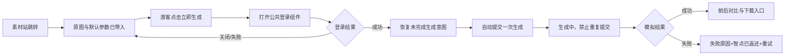

# AI应用广场高保真转化原型实施方案

> 文档用途：指导 AI 开发同学在现有 AI 应用广场原型项目内，实现一个可快速微调、可演示完整转化路径的高保真实验页。
>
> 核心决策：在原型项目内新增独立的“转化实验页”，以线上 AI 扩图工具详情页为视觉基准；不直接改动现有原型页，不制作脱离项目的一次性 HTML。

## 1. 背景与目标

### 1.1 业务背景

- 用户从百度搜索进入站长素材站，在素材详情页看到 AI 工具入口后，跳转至 AI 应用广场的工具详情页。
- 原素材图片会自动带入工具页，默认参数已可用，用户可直接点击“立即生成”。
- 游客必须登录后才能生成；手机号注册/登录使用公共组件，本次不修改该组件。
- 首次注册赠送 500 智点，一次生图消耗 490 智点，生成失败返还智点。
- 本次主要面向体量较大的普通猎奇用户，核心转化目标是将游客转为注册用户。

### 1.2 原型要验证的问题

1. 用户进入页面后，能否在数秒内明白页面能做什么。
2. 自动带入的原图、风格案例和效果展示，是否足以吸引用户点击“立即生成”。
3. 用户是否能理解“登录即赠 500 智点，可完成首次生图体验”，不产生明显付费焦虑。
4. 游客点击生成、完成登录后，能否无需再次操作就进入生成状态。
5. 生成中、成功、失败等状态是否能让用户安心等待并避免重复提交。

### 1.3 非目标

- 不修改素材站的页面和引流入口。
- 不重新设计手机号登录公共组件。
- 原型不调用真实生图、扣费、短信验证码或充值接口。
- 不在首版还原全站所有页面，只实现本次转化评审所需的页面和状态。
- 不在方案未确定前改造现有正式原型页。

## 2. 实现方式

### 2.1 技术与项目约束

当前项目使用 Next.js 16、React 19、TypeScript 和 Tailwind CSS 4，已有 `app`、`components`、`public` 和 `prototypes` 目录。新原型应沿用现有技术栈，不引入新的 UI 框架。

建议新增独立 App Router 路由：

```text
app/
└── prototypes/
    └── tool-conversion/
        └── page.tsx
```

建议的专属组件与配置：

```text
components/
└── prototypes/
    └── tool-conversion/
        ├── conversion-prototype.tsx
        ├── prototype-toolbar.tsx
        ├── tool-header.tsx
        ├── upload-and-settings.tsx
        ├── scene-gallery.tsx
        ├── before-after-preview.tsx
        ├── generation-status.tsx
        ├── reward-chest-dialog.tsx
        ├── mock-login-bridge.tsx
        ├── prototype-config.ts
        ├── prototype-types.ts
        └── prototype.css

public/
└── prototypes/
    └── tool-conversion/
        ├── source/
        ├── scenes/
        └── results/
```

> 如项目已有更适合的原型路由和组件组织规则，可调整具体路径，但必须保持“独立路由、独立样式作用域、不影响现有页面”。

### 2.2 不采用单文件 HTML 的原因

- 本次需要展示多种用户状态和局部 A/B 方案，单文件很快会变得难以维护。
- 使用现有技术栈可复用图标、对话框和基础组件，方案确定后也更容易合并。
- 配置化后，替换案例图、调整排序、改文案和间距不需要重构整页。

## 3. 页面范围与布局

### 3.1 基准页原则

- 以线上 AI 扩图工具详情页的页面框架、首屏高度、信息密度和操作路径为参考。
- 现有原型中与线上页面明显不同的部分，不应直接当作本次视觉基准。
- 只还原与游客注册转化直接相关的页面区域，其他功能允许使用静态占位。

### 3.2 桌面端首屏

- 验收基准宽度：`1440px`；同时检查 `1366px`、`1600px` 和 `1920px`。
- 上传与操作区宽度不得小于页面内容区的 `45%`，案例/效果区约 `55%`。
- 自动带入的原图、核心参数、“立即生成”和新用户权益必须在首屏可见。
- 工具用途缩减为一句话，例如：“AI 扩图：智能补全图片边缘，扩展画面比例，保留原图主体。”
- 原型中不修改主按钮文案，仍使用“立即生成”。

### 3.3 场景案例区

- 桌面端每行从 6 张调整为 4 张，使用统一图片比例和卡片高度。
- 场景名称完整显示，卡片有明确 hover 与选中态。
- 点击场景卡片后，同步更新左侧参数和右侧效果示例。
- 风格案例图支持点击放大，放大层只用于查看，不增加额外操作。
- 优先放置电影感、写真、手办、艺术化等普通用户能直观理解的强效果场景。
- 用同一主体或相同元素展示不同背景/风格，避免因案例主体不同导致无法比较效果。
- 需演示“上传后自动抠出主体并贴合至风格背景”的结果，但首版使用预制结果图，不实现真实抠图算法。

### 3.4 原图与结果展示

- 生成前可展示选中场景的预期效果案例，但必须标明为“效果示例”，不冒充当前图片的生成结果。
- 生成成功后提供原图/结果图前后对比，优先使用可拖动分割线。
- 图片必须保持真实比例，不拉伸；需裁切时使用明确的 `object-fit` 策略。

## 4. 原型状态机

开发时使用显式状态，不要通过多个相互独立的布尔值拼凑页面状态。

```ts
export type PrototypeState =
  | "guest-ready"
  | "login-open"
  | "login-success"
  | "submitting"
  | "generating"
  | "still-generating"
  | "success"
  | "failed-refunded"
  | "insufficient-balance";
```

### 4.1 核心流程



### 4.2 状态表

| 状态 | 页面表现 | 允许操作 |
|---|---|---|
| `guest-ready` | 原图和默认参数已带入；显示“登录即赠 500 智点”；弱化或隐藏具体消耗 | 换图、选参数、选场景、立即生成 |
| `login-open` | 公共登录组件打开，底层页面数据不丢失 | 模拟登录成功、关闭 |
| `login-success` | 显示已登录和智点信息，立即恢复生成意图 | 无需再次点击生成 |
| `submitting` | 点击后 300ms 内出现反馈，按钮禁用 | 不允许重复提交 |
| `generating` | 展示“已提交/生成中”阶段、骨架屏或轻量动画 | 可浏览其他区域，任务继续 |
| `still-generating` | 超过模拟等待阈值后显示“仍在生成” | 不给出虚假精确百分比 |
| `success` | 自动滚动到结果区，展示前后对比 | 放大、下载、再次生成 |
| `failed-refunded` | 在结果区显示失败原因、“智点已返还”和重试入口 | 重试，不二次登录 |
| `insufficient-balance` | 使用决策型弹窗提示余额不足 | 取消或进入充值/赚智点演示 |

### 4.3 登录后自动生成的防重复要求

- 游客点击生成时，记录一个待恢复的生成意图，包含图片、参数、场景和唯一 `intentId`。
- 只在登录成功且该 `intentId` 尚未消费时自动提交一次。
- 登录回调重复执行、组件重渲染或用户快速点击，都不能产生第二次提交。
- 提交后立即将该意图标记为已消费；失败重试必须生成新的 `intentId`。
- 原型中用模拟日志展示提交次数，便于验收“只提交一次”。

## 5. 评审控制面板

在页面右侧增加仅原型环境可见的悬浮面板 `PrototypeToolbar`，不属于最终产品 UI。

### 5.1 必须支持的切换项

- 页面版本：线上基准版 / 本次优化版。
- 用户状态：未登录 / 已登录。
- 任务状态：就绪 / 登录弹窗 / 提交中 / 生成中 / 仍在生成 / 成功 / 失败退款 / 余额不足。
- 源图状态：已从素材站带入 / 未上传 / 用户替换。
- 局部开关：登录前是否显示智点消耗、是否显示前后对比、是否演示自动抠图、是否展示宝箱奖励。
- 模拟操作：登录成功、生成成功、生成失败、恢复初始状态。

### 5.2 URL 参数

状态需可通过 URL 复现，便于产品同学直接分享指定方案：

```text
/prototypes/tool-conversion?variant=optimized&state=guest-ready
/prototypes/tool-conversion?variant=optimized&state=generating
/prototypes/tool-conversion?variant=optimized&state=failed-refunded
```

- URL 参数与控制面板必须双向同步。
- 无效参数回退到 `optimized + guest-ready`，不应导致白屏。
- 评审面板提供“复制当前状态链接”。

## 6. 配置化要求

将高频调整项放入 `prototype-config.ts`，不要散落在 JSX 和 CSS 中。

```ts
export const prototypeConfig = {
  tool: {
    name: "AI扩图",
    description: "智能补全图片边缘，扩展画面比例，保留原图主体。",
    generateLabel: "立即生成",
    newUserBenefit: "新用户登录即赠500智点",
    costPoints: 490,
    waitHint: "预计需等待一小会儿",
  },
  layout: {
    operationRatio: 45,
    galleryRatio: 55,
    desktopColumns: 4,
    tabletColumns: 2,
    mobileColumns: 1,
  },
  timings: {
    submittingMs: 300,
    generatingMs: 3000,
    stillGeneratingMs: 8000,
  },
  scenes: [],
} as const;
```

### 6.1 CSS 变量

至少将以下内容作为页面级 CSS 变量：

```css
.tool-conversion-prototype {
  --operation-ratio: 45%;
  --gallery-ratio: 55%;
  --scene-columns: 4;
  --scene-gap: 16px;
  --panel-radius: 12px;
  --control-height: 40px;
  --primary-color: #575ce9;
  --page-background: #f8faff;
  --border-color: #e7ebf5;
}
```

使用页面根类限制样式作用域，不要在 `app/globals.css` 中写宽泛选择器修改现有页面。

## 7. 关键交互规则

### 7.1 未上传图片

- 点击“立即生成”时不弹出阻断式对话框。
- 上传区就地高亮，显示“请先上传图片”，页面滚动并将焦点移到上传入口。
- 上传成功后自动清除错误态。

### 7.2 费用与权益

- 未登录时，重点显示“新用户登录即赠 500 智点”，弱化或隐藏具体的 490 智点消耗。
- 登录后显示当前智点及“490 智点/次”。
- 新用户权益信息和大致等待时间放在生成按钮附近，但不把所有信息塞进按钮文案。
- 在平均生成耗时尚未统计前，原型使用模糊而真实的等待提示，不写虚构的精确秒数。

### 7.3 生成反馈

- 点击生成后 `300ms` 内出现可见反馈，按钮立即禁用。
- 允许展示“提交成功、生成中、审核中、已完成”等真实阶段，不使用虚假精确百分比。
- 生成任务完成后自动滚动到结果区，但用户主动滚动时不要反复抢占视口。
- 生成失败时在结果区说明原因、返还结果和重试方式，不只显示短暂 toast。

### 7.4 统一反馈分级

| 问题类型 | 反馈方式 | 示例 |
|---|---|---|
| 输入缺失/格式错误 | 就地高亮+靠近错误位置的文字 | 未上传、图片格式错误 |
| 需要用户决策 | 对话框 | 余额不足、充值/赚智点 |
| 任务过程 | 结果区持续状态 | 生成中、仍在生成 |
| 任务失败 | 结果区失败卡 | 原因、智点已返还、重试 |
| 轻量成功反馈 | Toast | 复制链接成功 |

### 7.5 任务奖励宝箱

- 奖励层不自动关闭，支持关闭按钮和遮罩关闭。
- 奖励层出现有延迟可接受，但不得暂停或拦截已发起的生成任务。
- 关闭时使用轻量动画将奖励图标收起至“做任务赚智点”入口。
- 多笔奖励合并展示，每笔奖励只展示一次。
- 支持 `prefers-reduced-motion`；减少动画时用淡出代替飞入。

## 8. 视觉实现约束

- 延用项目已确认的主色 `#575ce9`、页面底色 `#f8faff`、常规线 `#e7ebf5`。
- 不使用大面积渐变、泛光阴影或过度动画制造“高级感”。
- 图标优先复用当前项目中的 Phosphor Icons，不临时手绘 SVG，不混用多套风格。
- 不随意加粗；只有标题、选中态和关键数字提高字重。
- 所有可点击区域具有指针和轻量 hover 反馈，hover 默认不改变文字和图标颜色。
- 案例图、原图和结果图不拉伸，不使用明显低清素材做高保真评审。

## 9. Mock 数据与安全边界

- 所有生成结果使用本地预制图片，禁止调用线上生图接口。
- 原型不发送真实短信，不使用真实手机号、验证码或用户凭证。
- 原型不调用真实扣费、充值、退款和任务奖励接口。
- 模拟登录组件只需还原公共组件外观和回调行为，不尝试修改 `components/auth/login-modal.tsx`。
- 所有延迟使用可清理的 timer，页面卸载或切换状态时必须取消，避免过期回调污染当前状态。

## 10. 埋点预留

首版不必接入真实埋点平台，但事件名和参数应在原型中以日志方式预留：

| 事件 | 触发时机 | 关键参数 |
|---|---|---|
| `tool_landing_view` | 进入工具页 | `source`, `toolId`, `variant`, `imageCarried` |
| `scene_card_click` | 点击场景 | `sceneId`, `position`, `variant` |
| `generate_click` | 点击生成 | `loginStatus`, `sceneId`, `imageStatus` |
| `login_modal_view` | 因生成打开登录 | `trigger=generate` |
| `login_success` | 登录成功 | `trigger=generate`, `intentId` |
| `generation_auto_resume` | 登录后自动恢复 | `intentId`, `submitCount` |
| `generation_result` | 生成结束 | `success`, `mockDuration`, `refunded` |

日志面板需能查看当前演示过程的事件顺序，用于检查登录后是否仅自动提交一次。

## 11. 分阶段交付

### 阶段 1：可评审首屏

- 完成独立路由和线上基准版/优化版切换。
- 还原工具首屏、自动带入图片、操作区和 4 列场景案例。
- 完成权益信息的登录前/登录后差异展示。
- 完成未上传时的就地高亮。

### 阶段 2：转化主路径

- 完成游客点击生成、模拟登录、登录后自动生成。
- 完成提交中、生成中、仍在生成、成功和失败退款状态。
- 完成防重复提交演示和事件日志。

### 阶段 3：结果吸引力

- 完成原图/结果图拖动对比。
- 完成场景案例放大、风格切换和预制自动抠图效果。
- 完成场景排序与素材配置化。

### 阶段 4：补充反馈

- 完成余额不足、宝箱奖励和减少动画模式。
- 进行响应式、键盘操作和基础可访问性检查。

> 每个阶段完成后都要保持页面可独立评审，不要等全部完成后才首次展示。

## 12. 验收标准

### 12.1 必须通过

- [ ] 新原型使用独立路由和样式作用域，不影响现有页面。
- [ ] 在 `1440px` 宽度下，原图、核心参数、生成按钮和权益提示首屏可见。
- [ ] 线上基准版与本次优化版可一键切换。
- [ ] 桌面端案例每行 4 张，卡片比例、高度和选中态一致。
- [ ] 未上传时点击生成，上传区就地高亮，不弹阻断弹窗。
- [ ] 游客点击生成后打开模拟公共登录组件，图片和参数不丢失。
- [ ] 模拟登录成功后自动提交且仅提交一次，无需再点“立即生成”。
- [ ] 点击生成后 300ms 内有反馈，生成期间不能重复提交。
- [ ] 生成中不显示虚假精确百分比。
- [ ] 成功状态可查看前后对比；失败状态明确告知“智点已返还”并提供重试。
- [ ] URL 可保存并恢复指定方案和状态。
- [ ] 页面不调用真实短信、生图、扣费、充值或退款接口。
- [ ] `pnpm lint` 和 `pnpm build` 通过，不新增控制台错误。

### 12.2 视觉检查

- [ ] 与线上工具页的视觉结构和信息密度接近，不是对旧原型的小修小补。
- [ ] 在 `1366px`、`1440px`、`1600px`、`1920px` 宽度下无横向滚动和明显错位。
- [ ] 案例图和结果图清晰、不变形，相同主体在不同风格间具有可比性。
- [ ] 权益信息靠近主操作且不抢主按钮视觉层级。
- [ ] 控制面板与产品页明确区分，截图时可隐藏。

## 13. AI 开发执行规则

1. 先阅读本文档与 `docs/product/AI应用广场页面优化.md`，再检查现有代码和资产，不先入为主地重新设计。
2. 实现前先记录线上页的基准视口、布局和核心状态；对无法确认的规则使用显式假设，不虚构业务逻辑。
3. 先实现阶段 1 的完整可评审版，再继续后续阶段；不在第一次提交中扩大到全站改造。
4. 复用项目现有基础组件时，先确认不会改变其他页面；如需大幅修改，在原型目录内建立专用包装组件。
5. 将文案、场景、排序、图片路径、时序和局部方案开关配置化，保证后续小调整不需要改页面结构。
6. 每完成一个阶段，输出可访问路径、支持的 URL 状态、未完成项和自测结果。
7. 遇到与线上页面、现有原型或产品文档相互冲突的内容，暂停扩大实现并列出冲突点，由产品确认后再继续。

## 14. 开发交付说明模板

```text
原型访问路径：
当前完成阶段：
已实现的页面状态：
已实现的局部方案开关：
可复现状态的 URL：
模拟数据和资产来源：
本次未接入的真实能力：
已执行的验收检查：
与文档不一致或待产品确认项：
```

